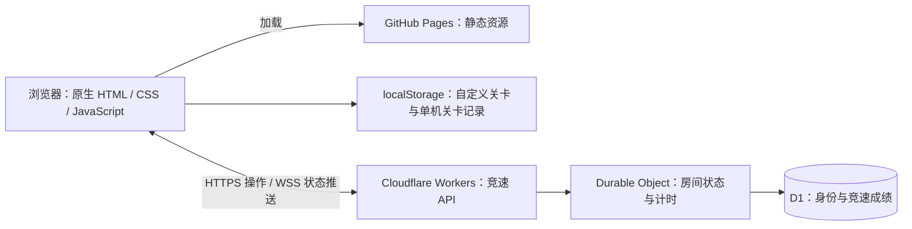

# 终末地模拟终端

**Endfield Simulation Terminal** · 玩法复现、自定义关卡与实时竞速

使用 GPT-6 辅助开发的非官方网页小游戏项目，以《明日方舟：终末地》中的「修复机器人」与「浮空回收」玩法为参考，实现规则引擎、交互界面、关卡编辑器，以及个人计时挑战和双人在线竞速。

[在线体验](https://njucodenoob.github.io/Endfield-Minigame/) · [Cloudflare 部署](cloudflare/README.md) · [Node.js / Ubuntu 部署](RACE_DEPLOYMENT.md) · [实现记录与参考资料](docs/IMPLEMENTATION_NOTES.md)

[](https://github.com/NjuCodeNoob/Endfield-Minigame/actions/workflows/pages.yml)

> 本项目与原游戏官方无隶属关系。玩法与视觉效果为独立实现，不包含原游戏源码。公开部署不代表取得原游戏素材的再分发授权，详见[素材与权利说明](#素材与权利说明)。

## 功能概览

| 模块 | 已实现内容 |
| --- | --- |
| 修复机器人 | 21 个内置关卡；多色行列计数、元件旋转、障碍格与固有色块 |
| 浮空回收 | 33 个内置关卡；浮力与双轴力矩判定、透视平台、倾斜与回弹动画 |
| 自定义关卡 | 两种玩法均支持创建、校验、种子分享、导入、删除和独立最佳记录 |
| 个人竞速 | 简单／混沌模式、随机 5 题、倒计时、最佳成绩、历史与排行榜 |
| 双人竞速 | 房间码、BO5／BO7／BO9、同题同步、实时比分、双方跳过、掉线判负 |
| 赛后复盘 | 参考解预览、种子复制；历史成绩与排行榜支持答案缩略图 |
| 视听与交互 | 黑白黄终端界面、操作音效、三首可选循环 BGM、键盘与指针操作 |

「敬请期待」是预留入口，尚未实现第三种玩法。

## 玩法与操作

### 修复机器人

将元件放入棋盘，使每一行、每一列的各色格数符合目标，并放置完所有元件。障碍格不能覆盖，固有色块位置固定且计入目标。判定接受所有符合规则的解，不要求复现参考答案。

- 拖动元件放置或调整位置，拖出棋盘可退回元件库。
- `R` 或鼠标右键旋转；旋转围绕固定抓取格进行。
- `Tab` 切换图形／数字计数；超出目标时显示斜纹计数块。
- 支持键盘选择、移动、放置，以及中文输入法下的物理按键识别。

自定义编辑器支持 **3×3–15×15** 棋盘、1–3 种颜色、21 种元件形状、障碍格与固有色块。作者先摆出合法解，系统据此生成目标并校验关卡。

### 浮空回收

在 5×5 平台的绑缚点上放置全部气球，使总浮力达标，且上下、左右力矩均为零。当前气球浮力为 **1、2、3、6**。

```text
水平力矩 = Σ 气球浮力 × (列坐标 − 中心列坐标)
垂直力矩 = Σ 气球浮力 × (行坐标 − 中心行坐标)
```

- 拖动气球到绑缚点，调整布局后点击完成回收。
- 两个棋盘气球可交换位置；库存气球放到已占位置时，原气球退回库存。
- 平台根据力矩倾斜，偏移指示显示具体数值。
- 自定义关卡可编辑绑缚点和气球库存，以平衡布局生成可分享种子。

### 竞速挑战

两个模块的关卡列表首位均为「竞速挑战」。昵称可修改、可重名；成绩身份由浏览器保存的令牌区分。

| 模式 | 修复机器人 | 浮空回收 |
| --- | --- | --- |
| 简单 | 3×3–7×7；1–2 色；至少 2 个元件；参考解的形状与颜色满足一种中心／轴对称 | 对称绑缚点布局；1–12 个气球；气球类型和解答布局不要求对称 |
| 混沌 | 4×4–8×8；1–3 色；至少 2 个元件；不要求对称 | 随机绑缚点布局；1–25 个气球 |

随机题从合法布局生成并校验可解。浮空回收使用力矩配平生成非对称解，不局限于相同气球成对放置。

- **个人竞速**：随机 5 题，首次倒计时 3 秒，完成后记录服务器计时成绩。换题与过渡时间计入总用时。
- **双人竞速**：双方解答同一道题，服务器先收到合法答案的一方得分；BO5／7／9 分别先得 3／4／5 分获胜。
- **跳过与异常**：双方同意才跳过，双方均不加分；题目耗尽按比分结算，可平局。比赛中失联超过 20 秒判负，加载超时 30 秒、单题超时 5 分钟，具体规则见[部署说明](RACE_DEPLOYMENT.md)。
- **完成反馈**：一秒结果过渡后自动换题，区分自己完成与对方完成；结束后可查看参考解并复制种子。

## 快速开始

### 本地运行

基础服务需要 **Node.js 22+**，不依赖第三方运行时包；前端无需构建。

```bash
git clone https://github.com/NjuCodeNoob/Endfield-Minigame.git
cd Endfield-Minigame
npm start
```

打开 **http://127.0.0.1:5173/**。

**测试本地竞速时**，在「竞速挑战 → 连接设置」填写 `http://127.0.0.1:5173` 并连接。仓库中的默认配置指向公开 Cloudflare 后端；仅启动本地网页不会自动切换竞速服务器。

双人测试需要使用两个独立浏览器、浏览器配置或无痕会话，避免共用同一身份。普通关卡无需连接竞速后端；直接打开 HTML 不作为推荐运行方式。

### 开发与检查

开发依赖使用 pnpm 锁定。建议使用 Node.js 24 LTS；Cloudflare 集成测试依赖 `node:sqlite`。

```bash
pnpm install
pnpm run check
pnpm test
```

测试覆盖规则判定、内置关卡求解、自定义种子、随机题约束、竞速计分、成绩存储、界面流程和 WebSocket 重连。Cloudflare 本地集成测试需先初始化 D1 并启动 Wrangler，步骤见[对应文档](cloudflare/README.md)。

| 命令 | 用途 |
| --- | --- |
| `npm start` / `pnpm start` | 启动 Node.js 静态资源与竞速 API 服务 |
| `pnpm run check` | 检查前后端脚本语法 |
| `pnpm test` | 运行 Node.js 测试与 happy-dom 界面测试 |
| `pnpm run cf:dev` | 启动 Cloudflare 本地模拟环境，默认端口 8787 |
| `pnpm run cf:test` | 验证本地 Cloudflare WebSocket、D1 与完整竞速流程 |
| `pnpm run cf:deploy` | 发布到已授权的 Cloudflare 账号 |

## 技术架构



- **前端**：原生 JavaScript 与 DOM／SVG／CSS，规则计算、界面交互和关卡数据分离；无需前端框架或打包步骤。
- **平台动画**：浮空回收通过三维格板建模、透视投影、射线拾取及弹簧阻尼，在 SVG 中表现平台倾斜。
- **关卡种子**：版本化、规范化编码与校验，确保同一种子在不同设备解析为相同关卡；导入时重新检查合法性。
- **竞速后端**：复用规则引擎，服务器控制开始时间、答案校验和计分；客户端不能直接提交成绩用时。
- **实时同步**：云端使用 WebSocket 推送与心跳重连；本地 Node.js 版本保留 HTTP 轮询。
- **持久化**：Durable Object SQLite 保存房间，D1 保存身份和成绩；成绩通过待写入记录与唯一 ID 去重，避免重试造成重复记录。

## 目录结构

```text
.
├── dist/                      # 可直接托管的前端源码与静态资源
│   ├── index.html             # 站点入口
│   ├── app.js / audio.js      # 首页与音频管理
│   ├── repair-*.js            # 修复机器人规则与关卡
│   ├── custom-*.js            # 修复机器人编辑器与种子协议
│   ├── salvage*.js            # 浮空回收规则、关卡、投影与编辑器
│   └── race*.js / race.css    # 竞速界面与服务地址配置
├── backend/                   # 共享随机出题与竞速规则服务
├── cloudflare/                # Worker、Durable Object、D1 迁移与部署配置
├── deploy/                    # Ubuntu systemd、Docker Compose 等部署文件
├── tests/                     # 单元、界面与集成测试
├── docs/                      # 详细实现记录与参考资料
├── server.mjs                 # 本地 / 自托管 Node.js 服务
└── .github/workflows/         # GitHub Pages 发布流程
```

## 部署与配置

当前公开前端使用 GitHub Pages，竞速服务使用 Cloudflare，**不依赖上海服务器**。推送 `main` 会触发 Pages 发布；Worker 需要单独执行部署命令。

- 默认竞速地址配置在 [`dist/race-config.js`](dist/race-config.js)，也可在界面中覆盖；界面设置保存在当前浏览器。
- 复制项目到自己的 Cloudflare 账号时，需要创建 D1，并更新 [`cloudflare/wrangler.json`](cloudflare/wrangler.json) 的账号、数据库与允许来源配置。项目中的资源 ID 不是授权凭证。
- 自托管服务支持 `HOST`、`PORT`、`RACE_DATA_FILE` 与 `ALLOWED_ORIGINS`，详见 [Node.js / Ubuntu 部署](RACE_DEPLOYMENT.md)。
- `workers.dev` 在部分网络不可达。绑定自定义域名后仍需测试实际玩家网络；本项目不保证所有地区的连接质量。

## 数据与实现边界

- **浏览器数据**：自定义关卡、普通关卡最佳记录保存在本机。清除站点数据会丢失这些记录；请提前复制重要关卡的种子。
- **竞速身份**：昵称可以重复，身份令牌保存在浏览器。暂不支持账号登录、跨设备身份恢复或旧部署成绩自动迁移。
- **种子包含参考解**：种子用于分享和复盘，不是加密或防作弊凭证。竞速过程中不公开种子与参考解。
- **成绩公平性**：服务器校验可防止直接篡改用时、元件和重复计分，但不能保证识别自动解题程序。独立随机题的实际难度不同；网络延迟也会影响极接近的提交顺序。
- **服务规模**：当前 Cloudflare 版本使用单个协调对象，上限为同时 64 场挑战，适合小规模试玩；尚未实现每房间分片。平台免费额度不是无限容量承诺。
- **视听效果**：这是基于参考资料的独立重建，不承诺逐像素、逐帧或音轨完全一致。音乐自动播放受浏览器策略限制，可能需要首次点击页面。

## 素材与权利说明

《明日方舟：终末地》及相关名称、标识、原始美术、音乐和录音等权益归相应权利人所有。部分音频来自提供的录制素材；处理记录见 [`sources.json`](dist/assets/audio/sources.json) 和 [`salvage-sources.json`](dist/assets/audio/salvage-sources.json)。参考视频与关卡对照保存在[实现记录](docs/IMPLEMENTATION_NOTES.md)。

当前仓库未声明统一开源许可证。仓库公开、素材被收入项目或项目不收费，均不代表授予第三方商用、再分发或原游戏素材使用权。复用代码与素材前，请分别确认许可；正式公开运营还需结合实际服务内容核实相关要求。

## 问题反馈

欢迎通过 [GitHub Issues](https://github.com/NjuCodeNoob/Endfield-Minigame/issues)反馈问题。建议附上游戏模块、关卡编号或自定义种子、复现步骤、浏览器版本及截图。联机问题请补充发生时间、网络环境和具体提示，**不要提交身份令牌、API Token 或 SSH 私钥**。
